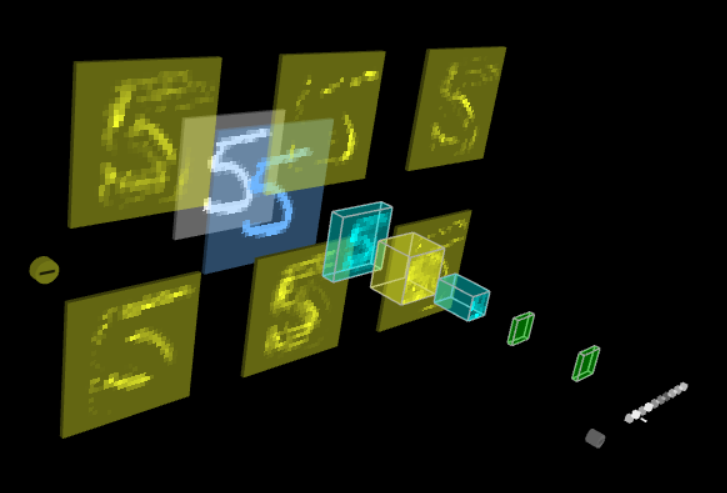
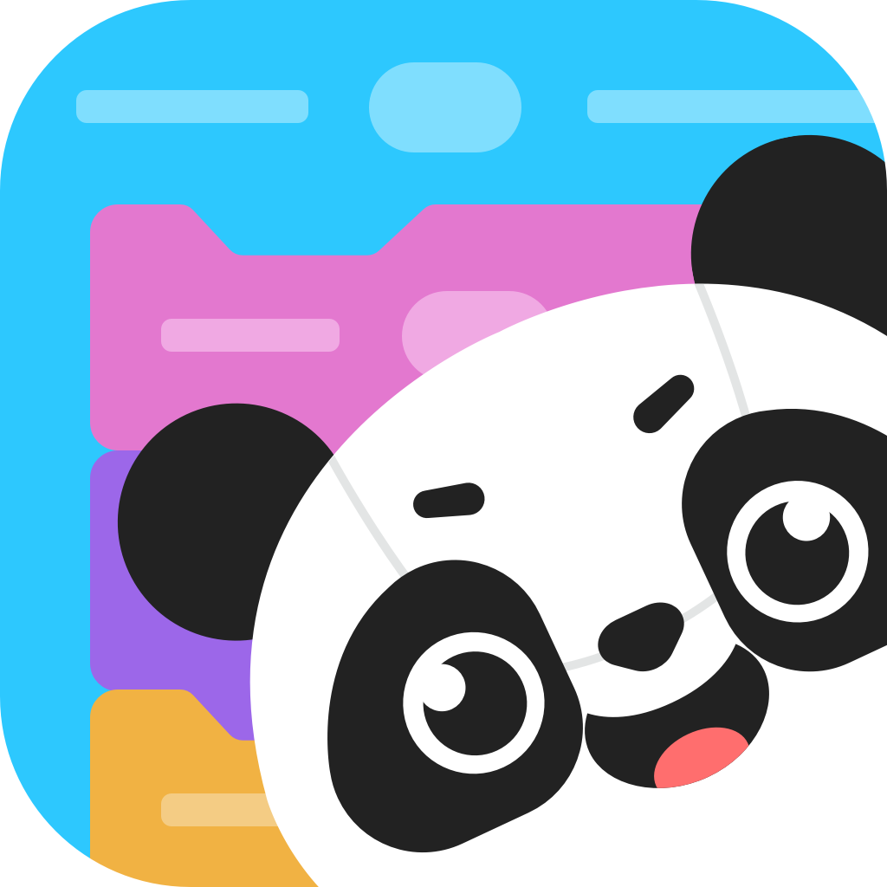

<!-- height or width of logo may be adjusted -->
<!-- This section is where you will replace the link to your transparent logo, the title of your project, and the very short desciptor of your project -->
<!-- If you used Canva to make your icon and don't want to pay for a background remover, you can use the website https://www.remove.bg/ to do so -->

  
  <h1 align="center">A simulation of Convolutional Neural Network for Self-Driving Cars</h1>
  
A project for all ages with an interest in Artificial Intelligence by team Autobots 

<!-- the emojis are not set in stone! If you'd like you can remove them entirely or select your own from https://gist.github.com/rxaviers/7360908 you are welcome to -->

## :loudspeaker: About
AutoBots is a maze puzzle where students get to learn how image recognition works with robots and how
proper data training is essential for robots to recognize images.
<!-- You can look at other TAP projects if you need a better idea of how to describe your workshops objectives -->

This workshop has participants train their own Convolutional Neural Network to recognize custom hand gestures and allow control of a Makeblock Mbot Mega. Students get to create their own distinct dataset based on images captured of their hand. The robot would then navigate through some obstacles and each gesture would reflect how well the robot could recognize those images.

## :bulb: Project Information
<!-- 
Your Options for target audience: 
  - High School
  - College
  - Middle School
  - K-12
  - Non-Stem
  - Undergraduate
You can select from a range of audiences or a single auidience. Examples: 
    Middle School - College 
    High School - College
    K-12
  You will be presenting most often to your peers who are taking introductory technology classes, so more often than not you should be including college in your target audience range. 
-->
* <b>Difficulty Level:</b> Intermediate
* <b>Target Audience:</b> 6-12, College, Non-Stem
* <b>Duration of Workshop:</b> 1 hour
* <b>Needed Materials:</b> Mbot Mega, Google Chrome web--browser, Laptop with camera
* <b>Learning Outcomes:</b> The primary goal is to show the audience how distinct training datasets can effect how well a neural network can recognize images. Specifications such as lighting and angle of the image can impact the accuracy of the model.
* <b>Your Main Technology</b> MBlock (Uses Scratch Block Coding)
* [Technology Ambassador Program](https://tapggc.org/) <b>(TAP)</b> is a project-based class that provides a collaborative environment for students to work with their fellow classmates on a semester-long project using technologies of their choice. TAP strives to increase participation in IT through numerous outreach activities and workshops that are designed to showcase the creative and fun side of technology.
<!-- Commercial Video stored in the Media folder will be linked here -->

https://github.com/user-attachments/assets/bf293176-6c56-42a5-abb3-8fcd7001cc5e

<!-- videos can also be dragged and dropped into markdown files if you want them embedded -->

## :pencil2: Team: Autobots

<!-- Use the team photo of your choice once youve uploaded it to the team photo folder within the media folder -->

> (From left to right: Jonathan, Krishan, and Isaiah)
<!-- replace with full names of your team members -->

* Jonathan Tran
* Krishan Bhalsod
* Isaiah Gorman
  

## :mortar_board: Advisors
<!-- name of the two professors overseeing your TAP class -->
* Dr. Cengiz Gunay
* Dr. Cindy Robertson

## :page_with_curl: Project Description
In this project, students will design custom hand gestures or images to represent specific movements or commands for an MBot robot. Using image recognition and machine learning, students will train a model to recognize these gestures and teach the robot to react accordingly—whether it’s moving forward, turning, stopping to navigating obstacles. This hands-on project will allow students to develop their skills in image recognition, AI model training, and robotics control, while exploring the complexities and challenges of creating real-world applications using AI and robotics technologies.

## :memo: Publications
<!-- team members, then professors/advisors. "Name of Publication", event, month and day, year, Georgia Gwinnett College. -->
1. Dekhane, S., Xu, X., Napier, N., Barakat, R., Gunay, C., & Nagel, K. (2018). Technology focused service-learning course to increase confidence and persistence in computing. Journal of Computing Sciences in Colleges, 34(2), 147-153.Hannes Hartenstein and Kenneth Laberteaux, Vehicular Applications and Inter-Networking Technologies, 1st edition, Wiley, February 2010. 

2. Mosquera Reina, V., Cunico, R., Williams, J., Bauer, M., Doloc-Mihu, A., & Robertson, C. (2021, October). Introducing Programming Concepts through Interactive Online Workshops. In Proceedings of the 22nd Annual Conference on Information Technology Education (pp. 71-72). 

3. Robertson, C., & Doloc-Mihu, A. (2021, October). Assessing the effectiveness of teaching programming concepts through online interactive outreach workshops. In Proceedings of the 22nd Annual Conference on Information Technology Education (pp. 123-128). 

4. “Scratch - Imagine, Program, Share.” [Online]. Available: https://scratch.mit.edu/. [Accessed: 03-Mar-2025] 

5. R. Yamashita, M. Nishio, R. K. G. Do, and K. Togashi, “Convolutional neural networks: an overview and application in radiology.,” Insights Imaging, vol. 9, no. 4, pp. 611–629, Aug. 2018, doi: 10.1007/s13244-018-0639-9. 

## :open_hands: Outreach
<i>List the outreach events your team has participated in. </i>

1. <b>Atlanta Science Festival<b> March 15, 2025, Georgia Gwinnett College: Promote IT field and teach Convolutional Neural Networks to those interested.
2. <b>Atlanta Science Festival<b> March 22, 2025, Piedmont Park (Atlanta): Promote IT field and teach Convolutional Neural Networks to those interested.
3. <b>Class Workshops<b> March 31 & April 1 & 4, 2025, Georgia Gwinnett College: Promote IT field and teach Convolutional Neural Networks to those interested.

## :mag_right: Similar Projects
<i>Use this section to link to a project done in the TAP program that is related in some way to your own. This can be a sister project done during your TAP semester or a TAP project done in the past. Example: </i> 

If you're interested in more workshops that utilize Scratch, check out [Space Mechanic](https://github.com/TAP-GGC/NinjaTurtles)!

## :computer: Technology
<i> Replace Scratch with whatever technology you're using and make sure to have a logo of that technology uploaded to the technology folder within the media folder. </i>
<!-- be sure to use the alt text feature in case anybody viewing your repo is using  screen reader! you want your workshop to be as accessible as possible -->

  

* [Scratch](https://scratch.mit.edu/) is a block-based programming language developed by the MIT Media Lab as an education tool for children to learn computing in a fun and interactive way.
* Scratch has drag-and-drop interfaces. Unlike text-based programming language like Java or C where you physically type every line of code, in Scratch, you can drag and drop pre-made codes and organize them into an algorithm. It's like solving a jigsaw puzzle!
* Autobots uses MBlock, which is a Scratch program that comes along with the MBot. While MBlock is Scratch-based, it also contain Google's teachable machine, which helps train the MBot in image recognition.

## Project Setup/Installation 
<i> This section is dedicated to linking to .md files in your documents/tutorial/ folder that will contain instructions on installation

Your repo doesn't have to have every section used below. This is just an example so you can get an idea of what your own repo should look like</i>

### Opening a blank Scratch page 
[Click here to view instructions](/documents/tutorial%20materials/Opening%20a%20blank%20Scratch%20page.md)

[Video with Scratch instructions](https://youtu.be/v-GUbj7DMEE)

<!-- if your project uses scratch, you can reuse any of these instructions (be sure to include CS First alternatives) -->
## MBot connection to MBlock
1. Click on the link here: https://planet.mblock.cc/project/5574657
2. Turn on MBot
3. Scroll down and click source code
4. On the device tab, select bluetooth, enable bluetooth if prompted, and connect.
5. If done right, the blue light within the MBot will stop blinking.
   
[Click here to view instructions](/documents/tutorial%20materials/CS%20FIRST/CS%20First%20Walkthrough.md)

## Usage
<i> Post connection to the MBot with MBlock open with the correct link. WEBCAM IS NEEDED. </i> 
1. On the sprite tab, scroll down from the open bar where all code blocks are stored.
2. If done correctly, there is a block for teachable machine. Click on it.
3. On top of the block codes, there is a Create/Manage model. Click on it.
4. Scroll down and select Image Recognition (or alike).
5. Ensure that webcam is enabled/turned on. Create desired amount of classes.
6. Using the webcam, take a single or multiple pictures of your desired object. In this case, hands would be the object.
7. Do this for all classes. Ensure that each object is distinct from each other.
8. When finished, change model settings to your desired preference. For this project, keep settings default. Click on train model.
9. When finished, webcam should turn on. Test your objects to ensure right classes are being identified.
10. If correct, click on the top left to use model.
11. While on the sprite tab, replace all instances of model name and classes to your model/class naming convention.
12. Run code to test if models and classes are working. If it is not working, check if all instances are correctly placed (i.e. Stop function is replaced with Stop class equivalent). Otherwise, you just made your first Convolutional Neural Network model!

## Short Demo Instructions 
[Demo Video on how to install and play our game](https://youtu.be/mA80Aa55t-U)

## Workshop Instructions 
[Click here to view workshop walkthrough pdf file](/documents/tutorial%20materials/Scratch%20Workshop%20Walkthrough.pdf)

[Our Game Workshop Video](https://youtu.be/Mtsre0iMStM)

